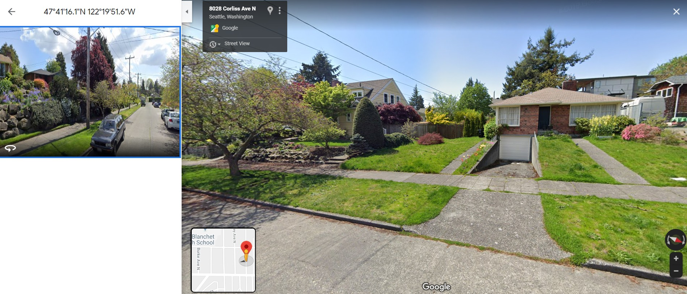

#  Introducción

Los datos que se van a analizar en este proyecto han sido obtenidos desde Kaggle. Contienen precios de casas que fueron vendidas desde mayo de 2014 hasta mayo de 2015 en **King County** que es un condado ubicado en el estado estadounidense de Washington. 

Se van a seguir los siguientes pasos:

 - Objetivo del estudio.  
 - Descripción de los datos.
 - Train, test y validación.
 - Análisis exploratorio de datos.
 - Detección, tratamiento e imputación de datos faltantes.
 - Selección de variables.
 - Ajuste, interpretación y diagnosis del modelo de regresión lineal múltiple.
 - Test.
 - Validación.
 - Conclusiones y líneas futuras.


## Objetivo del estudio

Lo que queremos hacer con estos datos es crear un modelo para poder predecir los precios de las casas en King County, basándose en las variables que se incluyen en el dataset con el que se va a trabajar.

## Descripción de los datos

Los datos con los que se van a trabajar han sido extraidos de Kaggle: https://www.kaggle.com/harlfoxem/housesalesprediction

Contamos con un total de 21 variables que hacen referencia a las características de las casas, a la calidad y a la localización y con aproximadamente unas 21.000 observaciones. No todas las variables han sido relevantes para nuestro estudio. A continuación, se detallan las más importantes.


```{r, lectura_datos, include=FALSE}

#datos <- read.csv("C:/Users/natal/OneDrive/Documentos/0_MIS_DOCUMENTOS/2.MÁSTER/2_Curso_2019-2020/Primer_Cuatrimestre/2.Fundamentos_de_Análisis/BloqueIV_Métodos/Práctica final/git/kc_house_data.csv")

#datos <- read.csv("C:/Users/Beatriz/Desktop/Máster/1er trimestre/Fundamentos/Parte 4_Métodos de Análisis de datos/Prac_git/kc_house_data.csv")


datos <- read.csv("C:/Users/susi_/Desktop/R/Practica_Fundamentos_R/Repositorios git/kc_house_data.csv")
```

```{r, setup, include=FALSE}
knitr::opts_chunk$set(echo = TRUE)
library(lattice)
library(dplyr)
library(VIM)
library(mice)
library(DMwR2)
library(knitr)
library(kableExtra)
library(htmltools)
library(bsplus)
library(RColorBrewer)
library(GGally)
library(ggplot2)
library(corrplot)
library(vcd)
library(DT)
library(gridExtra)
library(jpeg)
library(car)
library(leaflet)
library(scales)
library(cowplot)
```

# Train, test y validación

Lo primero que se va a realizar es separar los datos en los 3 conjuntos de datos fundamentales:  

-  Conjunto de datos de **entrenamiento**: en nuestro estudio **datos_train**, se corresponde con el 70% del total de los datos.
-  Conjunto de datos de **validación**: en nuestro estudio **datos_validacion**, se corresponde con el 15% del total de los datos.
-  Conjunto de datos de **test**: en nuestro estudia **datos_test**, se corresponde con el 15% del total de los datos.

```{r, fig.align='center', warning=FALSE,echo=FALSE}

num_total=nrow(datos)
set.seed(122556) #reproductividad

# 70% para train
indices_train = sample(1:num_total, .7*num_total)
datos_train = datos[indices_train,]

# 15% para test
indices=seq(1:num_total)
indices_test=indices[-indices_train]
indices_test1 = sample(indices_test, .15*num_total)
datos_test = datos[indices_test1,]

# 15% para validacion
indices_validacion=indices[c(-indices_train,-indices_test1)]
datos_validacion=datos[indices_validacion,]

```


# Análisis exploratorio de datos

Para el análisis de los datos, se han dividido las variables en tres categorías:

  -**Variables de características de las casas**: price, sqft_living, bedrooms, bathrooms, floors, sqft_basement.
  
  -**Variables de calidad**: waterfront, view, condition, grade y yr_renovated.
  
  -**Variables de localización**: zipcode, lat y long.


```{r, fig.align='center', warning=FALSE,include=FALSE}
datatable(head(datos_train))   
```


```{r, fig.align='center', warning=FALSE,include=FALSE}
str(datos_train)
summary(datos_train)
```


```{r, fig.align='center', warning=FALSE,echo=FALSE}
datos_train <- datos_train[,-2]
```


```{r, fig.align='center', warning=FALSE,echo=FALSE}
datos_train$id <- as.factor(datos_train$id)
```

## Características de las casas

A continuación, se va a realizar un análisis exploratorio para ver cómo se comporta cada variable:  


**-Variable Price**: es numérica, es la variable respuesta del estudio:

```{r, fig.align='center', warning=FALSE,echo=FALSE}

options(scipen=999)
options(repr.plot.width=6, repr.plot.height=3,align="center")
p1a<-ggplot(datos_train, aes(x= price)) + geom_histogram(aes(y=..density..), bins=30, colour="black", fill="white") + geom_density(alpha=.3, fill="#E1AF00")

datos_train$log_price<- log10(datos_train$price)
options(scipen=999)
options(repr.plot.width=6, repr.plot.height=3,align="center")

p1b<-ggplot(datos_train, aes(x=log_price)) + geom_histogram(aes(y=..density..), bins=30, colour="black", fill="white") + geom_density(alpha=.3, fill="#E1AF00")
grid.arrange(p1a,p1b,nrow=1)

```

Se observa que el precio de las casas es asimétrico, tiene mayor frecuencia hacia el lado izquierdo de la distribución. En estos casos se suele hacer una **transformación logarítmica**. Como se observa con la transformación logarítmica de la variable price (log_price), obtenemos una distribución más simétrica. 


**-Variable sqft_living**: es numérica. Se va a pintar un histograma y la densidad para ver su comportamiento. 

```{r, fig.align='center', warning=FALSE,echo=FALSE}

p5<-ggplot(datos_train, aes(x=sqft_living)) + geom_histogram(aes(y=..density..), bins=30, colour="black", fill="white") + geom_density(alpha=.3, fill="#E1AF00")

p6<-ggplot(datos_train, aes(sqft_living, log_price)) +
  geom_point(alpha = 0.5) +
  geom_smooth(se = F, method = "lm", color = "red") +
  scale_y_continuous(breaks = seq(0,8000000, by = 1000000)) 


datos_train$log_sqft_living<- log10(datos_train$sqft_living)

#options(scipen=999)
#options(repr.plot.width=6, repr.plot.height=3,align="center")
p5.1 <- ggplot(datos_train, aes(x=log_sqft_living)) + geom_histogram(aes(y=..density..), bins=30, colour="black", fill="white") + geom_density(alpha=.3, fill="#E1AF00")

p6.1 <- ggplot(datos_train, aes(log_sqft_living, log_price)) +
  geom_point(alpha = 0.5) +
  geom_smooth(se = F, method = "lm", color = "red") +
  scale_y_continuous(breaks = seq(0,8000000, by = 1000000))

grid.arrange(p5,p6,p5.1,p6.1, nrow=2)


```


Viendo la distribución de la variable (primer gráfico), se va a realizar una transformación logarítmica. Se puede observar cómo ahora los datos se han normalizado. En el segundo gráfico podemos ver que hay una relación creciente, a medida que aumentan los pies cuadrados aumenta el precio de las casas.


**-Variable Bedrooms, bathrooms, floors**: son numéricas.

```{r, fig.align='center', warning=FALSE,echo=FALSE}
table(datos_train$bedrooms)
table(datos_train$bathrooms)

datos_train$bathrooms_group <- cut(datos_train$bathrooms,breaks = c(-1,0.25,1,2,3,4,5,6,7,8),labels=c(0,1,2,3,4,5,6,7,8))
datos_train$bathrooms_group <- as.numeric(as.character(datos_train$bathrooms_group))

table(datos_train$bathrooms_group)
table(datos_train$floors)
```


```{r, fig.align='center', warning=FALSE,echo=FALSE}
knitr::opts_chunk$set(echo = TRUE)
p1<-ggplot(datos_train, aes(x=bedrooms)) + geom_histogram(colour="black", bins =30,fill="tomato")

p2<-ggplot(datos_train, aes(x=as.factor(bedrooms), y=log_price, fill=as.factor(bedrooms))) + geom_boxplot()+
labs(x="bedrooms")+theme(legend.position="none")


#Dibujamos cómo queda agrupada enfrentada con la variable "price" ya transformada:
p3<-ggplot(datos_train, aes(x=as.factor(datos_train$bathrooms_group), y=log_price, fill=as.factor(datos_train$bathrooms_group))) + geom_boxplot()+
labs(x="bathrooms_group")+theme(legend.position="none")


p9<-ggplot(datos_train, aes(x=as.factor(floors))) + geom_histogram(colour="black", stat ="count",fill="tomato")

p10<-ggplot(datos_train, aes(x=as.factor(floors), y=log_price, fill=as.factor(floors))) + geom_boxplot()+
labs(x="floors")+theme(legend.position="none")

grid.arrange(p2,p3, p10, nrow=1)
```


Al generar la tabla y los gráficos se observa que hay casas con **0** habitaciones y **33** , más adelante tendremos que ver qué ocurre con estos datos. Viendo la tabla de los baños, vemos que hay valores entre 0, hasta 8, de 0.25 en 0.25. Agrupamos los baños en función del número de estancias que ocupa, no en función del número de piezas que tenga. Se observa que hay 7 casas con cero baños, puede que estos datos se tengan que tratar más adelante. Se puede observar cómo crece el precio de las casas a medida que aumenta el número de baños por casa.


En cuanto a floors hay que tener en cuenta que se contabiliza 0.5 plantas cuando una planta no tiene todo el espacio construido. Por ejemplo, si la planta baja tiene $50m^2$, y la buhardilla tiene $20m^2$, floors va a tomar el valor de 1.5. Esta variable es numérica. Las casas tienen entre 1 planta y 3.5 plantas, aunque la mayoría de ellas tienen entre 1 y 2 plantas. Podemos observar cómo aparenteme el número de plantas no influye en el precio de las casas.


**- Variable sqft_basement **: es numérica, pero la vamos a hacer categórica.  

```{r, fig.align='center', warning=FALSE,echo=FALSE}

options(scipen=999)
options(repr.plot.width=6, repr.plot.height=3,align="center")
p1<-ggplot(datos_train, aes(x=sqft_basement)) + geom_histogram(bins=30, colour="black", fill="#E1AF00") 

datos_train$sqft_basement_cat <- cut(datos_train$sqft_basement,breaks = c(-1,0,6000),labels=c(0,1))
p2<-ggplot(datos_train, aes(x=log_price, fill= as.factor(sqft_basement_cat))) + geom_density(alpha=.3)

grid.arrange(p1,p2,ncol=1)

```

Se observa que alrededor de unas 12.500 casas no tienen sótano, por lo que la vamos a transformar del siguiente modo:

- 0 -> casas que no tienen sótano.

- 1 -> casas que sí tienen sótano.


Tras la transformación hay un 60% de casas que no tienen sótano y un 40% que sí lo tienen. Se puede obervar que ambas categorías prácticamente siguen la misma distribución pero las casas que tienen sótano pueden llegar a ser más caras.


## Calidad

**- Variable waterfront, view, condition, grade **: 


```{r, fig.align='center', warning=FALSE,echo=FALSE}
datos_train$waterfront<-as.factor(datos_train$waterfront)
table(datos_train$waterfront)

datos_train$view<-as.factor(datos_train$view)
table(datos_train$view)

datos_train$condition<-as.factor(datos_train$condition)
table(datos_train$condition)

table(datos_train$grade)

datos_train$grade_categ <- cut(datos_train$grade, breaks = c(0,4,9,13), labels = c(0,1,2))
table(datos_train$grade_categ)
```


```{r, fig.align='center', warning=FALSE,echo=FALSE}

p1<-ggplot(datos_train, aes(x=waterfront, y=log_price, fill=as.factor(waterfront))) + geom_boxplot()+
labs(x="waterfront")+theme(legend.position="none")


p12<-ggplot(datos_train, aes(x=view, y=log_price, fill=as.factor(view))) + geom_boxplot()+
labs(x="view")+theme(legend.position="none")


p14<-ggplot(datos_train, aes(x=as.factor(condition), y=log_price, fill=as.factor(condition))) + geom_boxplot()+
labs(x="condition")+theme(legend.position="none")


p16<-ggplot(datos_train, aes(x=as.factor(grade), y=log_price, fill=as.factor(grade))) + geom_boxplot()+
labs(x="grade")+theme(legend.position="none")

#ggplot(datos_train, aes(x=as.factor(datos_train$grade_categ), y=log_price, fill=as.factor(datos_train$grade_categ))) + geom_boxplot() + labs(x="grade_categ")+theme(legend.position="none")

grid.arrange(p1,p12,p14,p16, nrow=2)


```

Waterfront es categórica. Toma valores 0 y 1 (dummy).  

 - 0 -> no tiene vistas al agua (se ha confirmado este dato con la latitud y longitud de la casa en google maps).
 - 1 -> tiene vistas al agua.
 
Se observa que las casas que tienen vistas al agua son más caras respecto de las que no tienen vistas al agua.
 
View es categórica y toma valores del 0 al 4. El 90% de las casas toman el valor "0", es decir, sus vistas son normales. Se observa que la mayoría de las casas no tienen buenas vistas y que las casas que tienen mejores vistas son más caras respeto de las otras.

Condition es categórica y toma valores del 1 al 5. La mayoría de casas tiene condición 3 y 4. Podemos observar cómo la distribución para los distintos valores que toma la variable es constante respecto al precio. 

Grade es categórica. Toma valores del 1 al 13. Cuando se enfrenta con la variable precio se ve que a mayor grado es mayor el precio de las casas. Se va a volver a categorizar del siguiente modo:

 - Valores de 1-4 -> calidad baja, se va a categorizar con valor 0
 - Valores de 5-9 -> calidad media, se va a categorizar con valor 1
 - Valores de 10-13 -> calidad alta, se va a categorizar con valor 2


Sigue el mismo patrón que antes, es decir, a mayor grado mayor precio.


**- Variable yr_renovated  **: categórica.


```{r, fig.align='center', warning=FALSE,echo=FALSE}
table(datos_train$yr_renovated)

```

Se observa que hay un año "0" y entendemos que son casas que no han tenido ningún tipo de renovación. La vamos a categorizar como:
 
 - 0 -> no ha tenido renovación (valor 0)
 - 1 -> sí ha tenido renovación (resto de años)

```{r, fig.align='center', warning=FALSE,echo=FALSE}
datos_train$yr_renovated_catg <-cut(datos_train$yr_renovated, breaks=c(-0.5,1933, 2015), labels= c("0","1"))
table(datos_train$yr_renovated_catg)

```

La mayoría de casas no han tenido ninguna renovación.

```{r, fig.align='center', warning=FALSE,echo=FALSE}
#Dibujamos cómo queda categorizada enfrentada con la variable "log_price"
ggplot(datos_train, aes(x=as.factor(datos_train$yr_renovated_catg), y=log_price, fill=as.factor(datos_train$yr_renovated_catg))) + geom_boxplot() + labs(x="0-No renovación / 1-Renovación")+theme(legend.position="none")

```

Se comportan de una manera similar respecto al precio.


## Localización

**- Variables zipcode, lat y long ** : son numéricas.

En este aparatado vamos a realizar un ggpairs para ver como se comportan las variables de localización respecto al precio.

```{r, fig.align='center', warning=FALSE,echo=FALSE}
ggpairs(datos_train,columns=c(21,16:18),mapping = aes(color = "red") )

```
 
Se observa lo siguiente:
 
   -  En el caso de **zipcode** podríamos agruparlo por códigos postales, aunque si observamos la correlación con el precio no es indicativa, ya que tiene un valor negativo próximo a cero.
   -  **lat**, **long**, a lo mejor se podría agrupar por tres tipos de latitud y longitud distintas.


```{r, fig.align='center', warning=FALSE,include=FALSE}
datos_train$zipcode<-as.factor(datos_train$zipcode)
table(datos_train$zipcode)

```


```{r, fig.align='center', warning=FALSE,echo=FALSE}
datos_train$Pricegroup<-cut(datos_train$price, c(0,250000,500000,750000,1000000,2000000,100000000), labels = c("Entre 0 y 250$","Entre 250$ y 500$","Entre 500$ y 750$","Entre 750$ y 1.000$","Entre 1.000$ y 2.000$","Más de 2.000$"))

center_lon = median(datos_train$long,na.rm = TRUE)
center_lat = median(datos_train$lat,na.rm = TRUE)

factpal <- colorFactor(c("black","blue","yellow","orange","pink","red"), 
                       datos_train$Pricegroup )

leaflet(datos_train) %>% addProviderTiles("Esri.NatGeoWorldMap") %>%
  addCircles(lng = ~long, lat = ~lat,
             color = ~factpal(Pricegroup))  %>%
  # controls
  setView(lng=center_lon, lat=center_lat,zoom = 12) %>%

  addLegend("bottomright", pal = factpal , values = ~Pricegroup,
            title = "Precio (en miles de $)",
            opacity = 1)

```


Como podemos ver en el mapa, las casas más caras son las que están cerca del lago.

# Detección, tratamiento e imputación de datos faltantes

En nuestros datos no tenemos datos faltantes, pero gracias al análisis exploratorio previamente hecho nos hemos dado cuenta de que tenemos outliers en diferentes variables.

En el caso de la variable **Bedrooms** hemos visto que hay 7 casas con 0 habitaciones y una con 33. 

Como en nuestro estudio no tenemos datos faltantes, hemos comprobado con la latitud y la longitud (véase la Figura 1), que la casa con 33 habitaciones es un dato erróneo, ya que su estructura es muy parecida a las casas de los alrededores y no tienen 33 habitaciones. Lo que vamos a hacer a continuación es suponer que la casa con 33 habitaciones es un NA y estudiar cómo imputar ese dato faltante.


{width=90%}

<div style="text-align: center">
Figura 1. Casa con 33 habitaciones.
</div>


Primero nos vamos a crear un dataframe auxiliar para probar diferentes métodos y poder tomar una decisión.

```{r, fig.align='center', warning=FALSE,echo=FALSE}
datos_train$posicion<-c(1:nrow(datos_train))

indice_hab33 <- datos_train[datos_train$bedrooms==33,]$posicion

datos_train_aux1 <- datos_train
datos_train_aux1$bedrooms[datos_train_aux1$bedrooms==33] <-NA

datos_train_aux2 <- datos_train
datos_train_aux2$bedrooms[datos_train_aux2$bedrooms==33] <-NA

datos_train_aux3 <- datos_train
datos_train_aux3$bedrooms[datos_train_aux3$bedrooms==33] <-NA
```

## Imputación con regresión simple

```{r, fig.align='center', warning=FALSE,include=FALSE}
#log_price,bedrooms,bathrooms_group,log_sqft_living,sqftlot,floors,sqft_above,lat,long
datos_mice<-datos_train_aux1[,c(21,3,22,23,6,7,12,17,18)]

# Imputación simple, regresión ordinaria:
imp_1 = mice(datos_mice, method = "norm.predict", m=1) # Cálculo método de imputación
datostrain_mice = complete(imp_1)  # Imputación de valores
datostrain_mice$posicion<-c(1:nrow(datostrain_mice))
```

```{r, fig.align='center', warning=FALSE,echo=FALSE}
#Ha imputado:
datostrain_mice[datostrain_mice$posicion == indice_hab33,]$bedrooms
```

Ha imputado con el valor 3.118659. Como las habitaciones toman valores discretos, nos quedamos con 3 habitaciones.

## Imputación con regresión estocástica

```{r, fig.align='center', warning=FALSE,include=FALSE}
datos_mice2<-datos_train_aux2[,c(21,3,22,23,6,7,12,17,18)]

# Imputación multiple, regresión estocástica:
imp_2 = mice(datos_mice2, method = "norm.nob", seed=1234)# Cálculo método de imputación
datostrain_mice2 = complete(imp_2)  # Imputación de valores sustiyuye 33
datostrain_mice2$posicion<-c(1:nrow(datostrain_mice2))
```

```{r, fig.align='center', warning=FALSE,echo=FALSE}
#Ha imputado:
datostrain_mice2[datostrain_mice2$posicion == indice_hab33,]$bedrooms
```

En este caso el valor que toma es 3.122092, por lo que coincide con el anterior en que son 3 habitaciones lo que tenemos que imputar.

## Imputación comparando los vecinos más cercanos

Otro modo de imputar el dato faltante es compararlo con los vecinos más cercanos.Para ello, lo que hemos hecho es calcular la diferencia entre la latitud de la casa con 33 habitaciones con el resto y lo mismo para la longitud. Luego hemos sumado esas diferenecias y nos hemos quedado con las 15 distancias más pequeñas.

```{r, fig.align='center', warning=FALSE,echo=FALSE}
datos_train_aux3$diferencia_lat<- abs(datos_train$lat[datos_train$bedrooms==33]-datos_train[,17])
datos_train_aux3$diferencia_long<- abs(datos_train$long[datos_train$bedrooms==33]-datos_train[,18])
datos_train_aux3$diferencia_total <- datos_train_aux3$diferencia_lat+datos_train_aux3$diferencia_long

casas_mas_cercanas <- as.data.frame(sort(datos_train_aux3$diferencia_total,index.return=TRUE))
indices_casas_cercanas <- casas_mas_cercanas$ix[2:16] # la primera no se coge porque es la propia casa con 33 habitaciones

mean(datos_train_aux3$bedrooms[indices_casas_cercanas])
```

El resultado que obtenemos en este caso es 3.2. Al igual que en los métodos anteriores, la imputación sería de 3 habitaciones.

Por lo que finalmente imputamos que esa casa tiene 3 habitaciones.

```{r, fig.align='center', warning=FALSE,echo=FALSE}
datos_train[datos_train$posicion == indice_hab33,]$bedrooms = 3
```

## Eliminación de Outliers

Como hemos comentado anteriormente, teníamos 7 observaciones con 0 baños y otras 7 con 0 casas, se ha decidido eliminar estas filas de la base de datos, ya que respecto al número de observaciones totales de los datos de entrenamiento es muy poco representativo y no va a afectar al resultado.

```{r, fig.align='center', warning=FALSE,echo=FALSE}

indices_cero_habitaciones<-datos_train[datos_train$bedrooms==0,]$posicion
datos_train<-datos_train[-indices_cero_habitaciones,]

datos_train$posicion<-c(1:nrow(datos_train))
indices_cero_banos<-datos_train$posicion[datos_train$bathrooms_group==0]
datos_train<-datos_train[-indices_cero_banos,]
```


# Selección de variables

Para hacer una selección de variables ya hemos estudiado como se comportan con la variable precio. A continuación se va a realizar una matriz de correlaciones para terminar de decidir con qué variables nos quedamos:

```{r, fig.align='center', warning=FALSE,echo=FALSE}

datos_train_cor2 <- datos_train[,c(21,3,22,23,6,7,12,17:20)]
correlation_matrix2 <- cor(datos_train_cor2, method = "spearman")
corrplot(correlation_matrix2, method = "color", tl.srt=45, addCoef.col ="black", number.cex =0.6,
         tl.cex = 0.7,tl.col="black", type= "upper")
```


# Ajuste, interpretación y diagnosis del modelo de regresión lineal múltiple


```{r, fig.align='center', warning=FALSE,echo=FALSE}
# Creamos un nuevo dataframe limpio, con las variables ya transformadas y categorizadas
datos_train_model <- datos_train[c(1,21,3,22,23,6,7:10,25,12,24,17:20,26)]
```

## Creación del modelo manual

Para crear el modelo manual, hemos ido introduciendo variables para ver como se ajustaba el coeficiente de determinación.

Para este apartado nos hemos basado en la matriz de correlaciones del apartado anterior y en los gráficos del análisis exploratorio.

  -**Modelo2**: hemos añadido las variables que mayor correlación tienen con nuestra variable respuesta, log_sqft_living (0.65), bathrooms_group(0.49) y lat (0.46) y las que con los gráficos se visualizaba que el precio aumentaba grade_categ y waterfront.
  
   El **Modelo2** es capaz de explicar casi el 68%  de la variabilidad observada en el precio de las casas (R-squared: 0.6829 ). El valor de $R^2$-ajustado es muy  cercano al $R^2$ (Adjusted R-squared: 0.6828) lo que indica que el modelo contiene predictores útiles. El test F muestra un p-value de 0.22e-15 por lo que el modelo en conjunto es significativo. Esto se corrobora con el p-value de cada predictor, en ambos casos significativo excepto grade_categ1.(Se podría volver a categorizar esta variable)
  

```{r, fig.align='center', warning=FALSE,echo=FALSE}
modelo2<-lm(formula = log_price ~ log_sqft_living + bathrooms_group + grade_categ + lat + waterfront, data = datos_train_model)
summary(modelo2) #-----> ELEGIDO!!
# R_squared = 0.68, 5 variables
```


**Conclusión**: Hemos visto que con waterfront y view, bedrooms y bathrooms_group, y log_sqft_living y sqft_living15, respectivamente, teniendo el resto de variables iguales, afectan mínimamente al $R^2$-ajustado. Por otro lado, yr_renovated_catg y long no aportan al modelo.

Finalmente hemos seleccionado el **Modelo2**, ya que hemos ido haciendo pruebas con las distintas variables que pensabamos que podían aportar valor al modelo pero hemos observado que el cambio es mínimo (0.01).

Aunque el modelo3 tiene un $R^2$ mayor, estamos introduciendo más variables y como hemos comentado anteriormente apenas sube el coeficiente (0.01), por lo que elegimos el modelo más sencillo (principio de parsimonia).


### Estudio de colinealidad (VIF)

A continuación, vamos a usar el **Factor de Inflación de la Varianza (VIF)**, para ver si existe colinealidad entre las variables seleccionadas para el modelo. Los límites de referencia que se suelen emplear son:

 - VIF = 1: Ausencia total de colinialidad.
 - 1 < VIF < 5: La regresión puede verse afectada por cierta colinialidad.
 - 5  < VIF < 10: Causa de preocupación.
 
El termino tolerancia es 1/VIF por lo que los límites recomendables están entre 1 y 0.1.

```{r, fig.align='center', warning=FALSE,echo=FALSE}
vif(modelo2) #nos da un factor que mida la inflacion de la varianza por tener variable co-lineales
```

En el modelo seleccionado vemos que no hay índices altos de colinealidad por lo que la elección de las variables es buena.

### Distribución normal de los residuos

Los residuos se deben distribuir de forma normal con media cero. Para comprobarlo vamos a realizar un QQ-plot
```{r, fig.align='center', warning=FALSE,echo=FALSE}

qqnorm(modelo2$residuals)
qqline(modelo2$residuals,col="red")

```

 Se confirma que los residuos sí se distribuyen de forma normal.

## Creación del modelo por selección automática.

Para comprobar si nuestra elección del modelo es la correcta, vamos a usar técnicas de selección automática.

### Fordward

Este método parte de un conjunto de variables vacío, de manera que este se incrementa con la variable que más mejora el modelo para la métrica seleccionada. Se incluye una variable a cada paso, hasta que se llega al número seleccionado o el modelo no mejora más.

```{r, fig.align='center', warning=FALSE,echo=FALSE}
#la función regsubsets con el método forward por defecto evalua 8 subconjuntos diferentes, en función del número de variables que quieras que tenga tu modelo, puedes hacer coef(modelo,n_variables_modelo)

mejor_modelo_forward <- leaps::regsubsets(log_price~., datos_train_model[,-1], method="forward") #forward

reg_sum_forward <- summary(mejor_modelo_forward)

reg_sum_forward$adjr2[5]
coef(mejor_modelo_forward,5)

```

Como se observa, el $R^2$ Ajustado nos proporciona 0.7137, aumenta respecto al modelo 2 en 0.03. Pero al obtener las variables predictoras del modelo con sus coeficientes, incluye sqft_living15, la cual está altamente correlada con log_sqft_living (0.75) y nosotros la hemos descartado de nuestro modelo2.


### Backward

Se parte del conjunto de todas las variables, de manera que este se disminuye con la variable que más mejora el modelo para la métrica seleccionada. Se elimina una variable a cada paso, hasta que se llega al número seleccionado o el modelo no mejora más.

```{r, fig.align='center', warning=FALSE,echo=FALSE}
mejor_modelo_backward <- leaps::regsubsets(log_price~., datos_train_model[,-1], method="backward") #backward

reg_sum_backward <- summary(mejor_modelo_backward)

reg_sum_backward$adjr2[5]
coef(mejor_modelo_backward,5)

```

Como se observa, el $R^2$ Ajustado nos proporciona 0.712, aumenta respecto al modelo 2 en 0.03. Pero al obtener las variables predictoras del modelo con sus coeficientes, incluye sqft_living15, la cual está altamente correlada con log_sqft_living (0.75) y nosotros la hemos descartado de nuestro modelo2.

**Conclusión**: Se han usado las técnicas de selección automática para ver si podíamos aumentar el coeficiente de correlación significativamente, pero observamos que apenas sube (0.03) respecto al modelo que hemos construido manualmente (modelo2), por lo que finalmente elegimos el modelo2, ya que pensamos que es el modelo que permite predecir con mayor precisión el precio de las casas.


# Test

Una vez realizado el análisis exploratorio de datos e implementado el modelo, vamos a comprobar si con el modelo elegido, obtenemos una buena predicción del precio. Para ello, ahora usaremos los datos de test. Primero, realizaremos las mismas transformaciones, agrupaciones y categorizaciones que realizamos con los datos de train. A continuación, con la función *predict*, aplicaremos el modelo 2, finalmente seleccionado, a los nuevos datos, obteniendo así la predicción del precio.


```{r, fig.align='center', warning=FALSE,echo=FALSE}
# TRANSFORMAR LOS DATOS DE TEST CONFORME A LO QUE HABÍAMOS DECIDIDO EN TRAIN:

#id
datos_test$id <- as.factor(datos_test$id)

#price
datos_test$log_price <- log10(datos_test$price)

#bathrooms
datos_test$bathrooms_group <- cut(datos_test$bathrooms,breaks = c(-1,0.25,1,2,3,4,5,6,7,8),labels=c(0,1,2,3,4,5,6,7,8))
datos_test$bathrooms_group <- as.numeric(datos_test$bathrooms_group)

#sqft_living
datos_test$log_sqft_living<- log10(datos_test$sqft_living)

#waterfront
datos_test$waterfront <- as.factor(datos_test$waterfront)

#view
datos_test$view <- as.factor(datos_test$view)

#condition
datos_test$condition <- as.factor(datos_test$condition)

#grade
datos_test$grade_categ <- cut(datos_test$grade, breaks = c(0,4,9,13), labels = c(0,1,2))

#sqft_basement
datos_test$sqft_basement_cat <- cut(datos_test$sqft_basement,breaks = c(-1,0,6000),labels=c(0,1))

#yr_renovated
datos_test$yr_renovated_catg <-cut(datos_test$yr_renovated, breaks=c(-0.5,1933, 2015), labels= c("0","1"))

#datos de test solo con las variables transformadas y sin la variable respuesta
datos_test_mod <- datos_test[c(1,22,4,23,24,7:11,25,13,26,15,27,17:21)]
```

```{r, fig.align='center', warning=FALSE,echo=FALSE}
#eliminamos la variable respuesta para predecir
predict_precio_test <- as.data.frame(predict(modelo2, newdata = datos_test_mod[-2,]))
colnames(predict_precio_test)[1] <- "predict_precio"
```

## Variable respuesta test vs valor predicho

Una vez obtenida la predicción del precio usando el modelo2, comparamos con el precio real calculando la diferencia entre ambos. Finalmente, hallamos la media de todas las diferencias y comprabamos que de media hay una diferencia de -0.02 aproximadamente, pero en escala logarítmica, si hacemos la transformación, sería aproximadamente 1$ de diferencia. 

```{r, fig.align='center', warning=FALSE,echo=FALSE}
datos_test_mod$id_aux <- rownames(datos_test_mod)
predict_precio_test$id_aux <- rownames(predict_precio_test)

comparacion <- merge(datos_test_mod,predict_precio_test,by="id_aux")
comparacion <- comparacion[,c(1,3,22)]
```

```{r, fig.align='center', warning=FALSE,echo=FALSE}
comparacion$precio_diff <- comparacion$log_price - comparacion$predict_precio
dif_media_test <- mean(comparacion$precio_diff)
dif_media_test

dif_media_test_unidades_naturales<-10^(dif_media_test)
dif_media_test_unidades_naturales
```

# Validación

Como los resultados usando los datos de test son buenos, realizamos una última comprobación repitiendo el mismo proceso con los datos de validación. Realizamos las transformaciones y obtenemos la predicción del precio usando el modelo 2.

```{r, fig.align='center', warning=FALSE,echo=FALSE}
# TRANSFORMAR LOS DATOS DE VALIDACIÓN CONFORME A LO QUE HABÍAMOS DECIDIDO EN TRAIN:

#id
datos_validacion$id <- as.factor(datos_validacion$id)

#price
datos_validacion$log_price <- log10(datos_validacion$price)

#bathrooms
datos_validacion$bathrooms_group <- cut(datos_validacion$bathrooms,breaks = c(-1,0.25,1,2,3,4,5,6,7,8),labels=c(0,1,2,3,4,5,6,7,8))
datos_validacion$bathrooms_group <- as.numeric(datos_validacion$bathrooms_group)

#sqft_living
datos_validacion$log_sqft_living<- log10(datos_validacion$sqft_living)

#waterfront
datos_validacion$waterfront <- as.factor(datos_validacion$waterfront)

#view
datos_validacion$view <- as.factor(datos_validacion$view)

#condition
datos_validacion$condition <- as.factor(datos_validacion$condition)

#grade
datos_validacion$grade_categ <- cut(datos_validacion$grade, breaks = c(0,4,9,13), labels = c(0,1,2))

#sqft_basement
datos_validacion$sqft_basement_cat <- cut(datos_validacion$sqft_basement,breaks = c(-1,0,6000),labels=c(0,1))

#yr_renovated
datos_validacion$yr_renovated_catg <-cut(datos_validacion$yr_renovated, breaks=c(-0.5,1933, 2015), labels= c("0","1"))

#datos de validacion solo con las variables transformadas y sin la variable respuesta
datos_validacion_mod <- datos_validacion[c(1,22,4,23,24,7:11,25,13,26,15,27,17:21)]
```

```{r, fig.align='center', warning=FALSE,echo=FALSE}
#eliminamos la variable respuesta para predecir
predict_precio_validacion <- as.data.frame(predict(modelo2, newdata = datos_validacion_mod[-2,]))
colnames(predict_precio_validacion)[1] <- "precio_pred"
```


## Variable respuesta validacion vs valor predicho

```{r, fig.align='center', warning=FALSE,echo=FALSE}
datos_validacion_mod$id_aux <- rownames(datos_validacion_mod)
predict_precio_validacion$id_aux <- rownames(predict_precio_validacion)

comparacion_val <- merge(datos_validacion_mod,predict_precio_validacion,by="id_aux")
comparacion_val <- comparacion_val[,c(1,3,22)]
```

```{r, fig.align='center', warning=FALSE,echo=FALSE}
comparacion_val$dif_precios <- comparacion_val$log_price - comparacion_val$precio_pred 
dif_media_val<-mean(comparacion_val$dif_precios)
dif_media_val

dif_media_val_unidades_naturales<-10^(dif_media_val)
dif_media_val_unidades_naturales
```

De nuevo, calculamos la diferencia entre el precio predicho y el real, y hallamos la media. En este caso, la diferencia media es de -0.018, muy similar a la anterior. Podemos concluir que el modelo es bueno.


# Conclusiones y líneas futuras

## Conclusiones

Por último, concluimos lo siguiente:

- Tras el análisis exploratorio, se deduce que las variables bedrooms, bathrooms, sqft_living, sqft_above, sqft_basement, waterfront, view, grade y yr_renovated, son variables que poseen una relación lineal muy clara con price. Sin embargo, sqft_lot, floors, condition y yr_built, son variables que no tienen una relación tan clara. Además, se observa que sqft_living15 y sqft_lot15 aportan una información muy similar a sqft_living y sqft_lot, por lo que no las tuvimos en cuenta.

- Para medir la correlación entre las variables, se calcula la matriz de correlación y se observa que las variables con mayor correlación con la variable respuesta price son: bathrooms, sqft_living, sqft_above y lat. También se concluye que sqft_living y sqft_above están altamente correlacionadas entre sí, por lo que para el modelo no las consideramos conjuntamente.

- Tras los dos análisis anteriores, y después de realizar varias pruebas para implementar el mejor modelo, concluimos que las variables más apropiadas para un modelo de regresión lineal son: **bathrooms, sqft_living, lat, grade y waterfront**. El modelo elegido, tiene asociado un *Adjusted R-squared* de 0.68, es decir, puede explicar un 68% de la variabilidad observada en el precio de las casas.

- Finalmente, con los datos de test y validación, comprobamos que el modelo seleccionado predice los precios con una diferencia con el precio real de aproximadamente 1$ de media. Podemos concluir que el modelo elegido para la predicción del precio es bastante preciso.

## Líneas futuras

Con la información obtenida de la selección de variables automática, y los resultados del modelo, se podrían plantear como trabajos futuros, la recategorización de algunas variables, como por ejemplo, view. Rechazamos el modelo 3, aunque poseía mejores métricas que el modelo 2, porque view introducía 4 variables dummies y waterfront solo 1. Podría analizarse si view podría agruparse de otro modo.

También se podría estudiar como se relaciona yr_built con price, y si podría aportar información al modelo. Lo mismo ocurre con zipcode, esta variable no la hemos considerado a estudio por poseer múltiples categorías, pero quizá agrupandola en subcategorías podría ser otra variable a considerar para el modelo.

Por último, hemos comprobado que con un modelo de regresión lineal se puede conseguir una buena estimación del precio, sin embargo, se podría comprobar si con otros modelos se podrían conseguir resultados similares, o incluso mejores.
